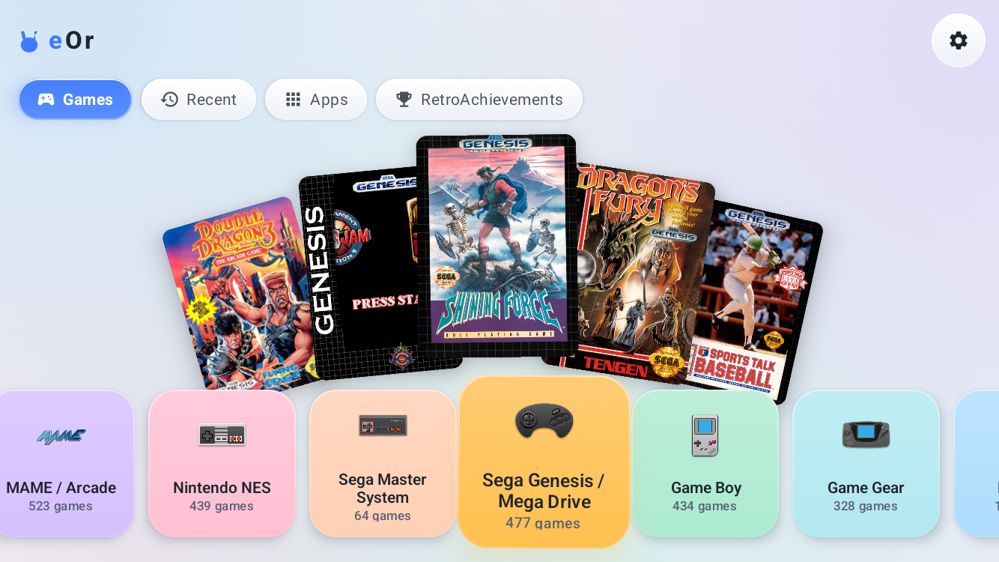
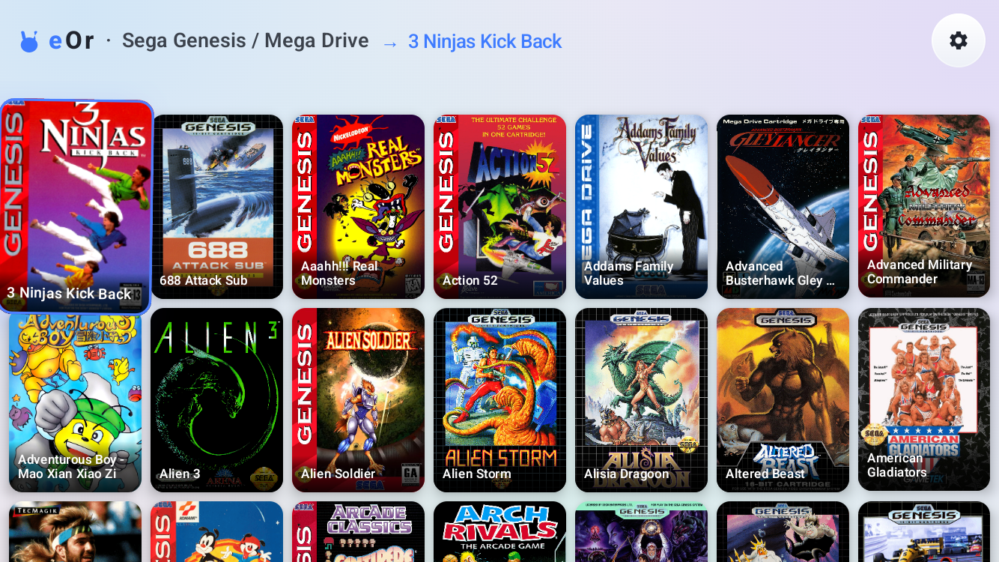
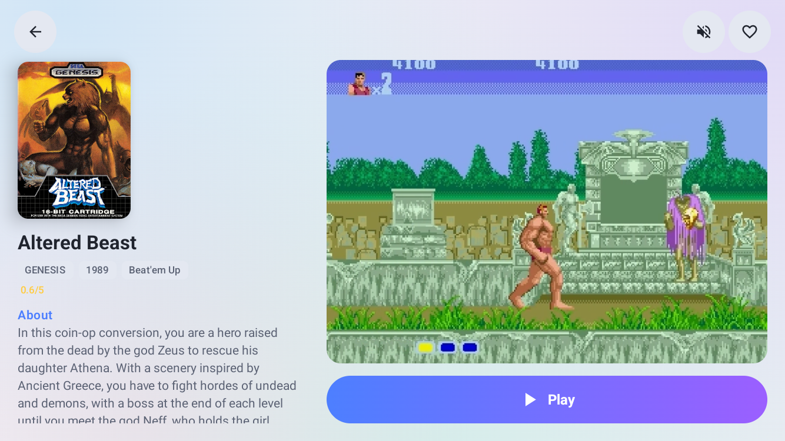
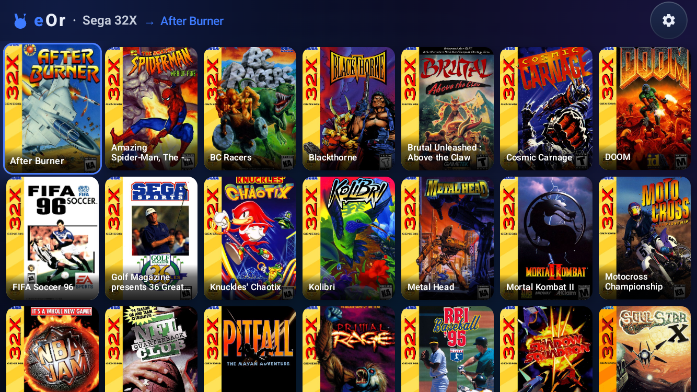
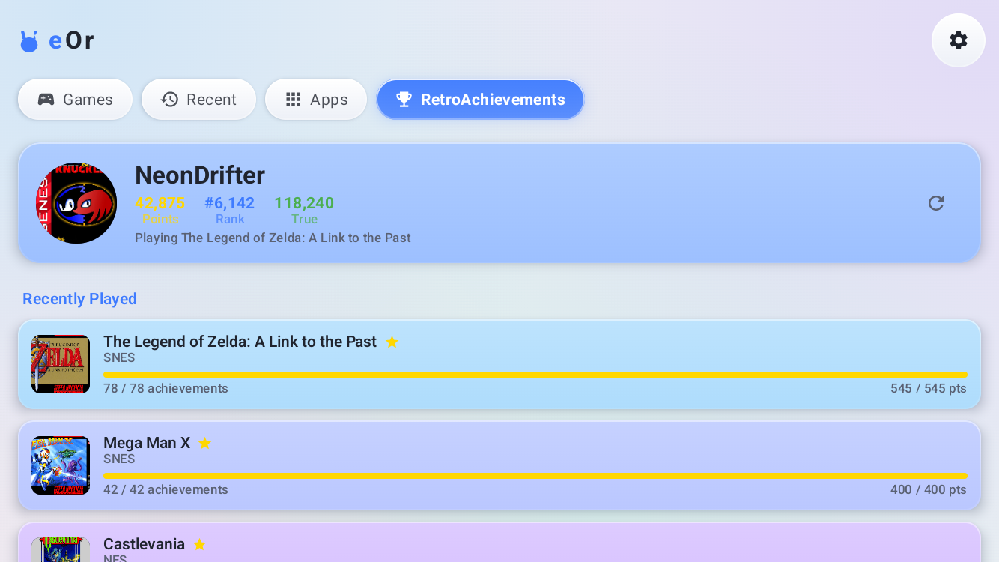
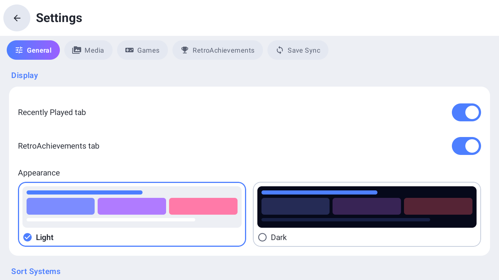
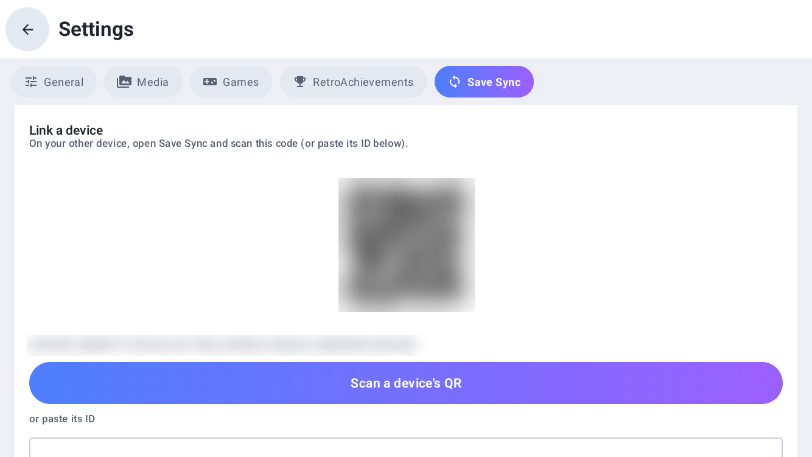

<div align="center">

# 🎮 eOr

### Your retro library, beautifully organized.

**eOr** — short for *emulation, organized* — is a fast, gorgeous game launcher for Android handhelds and phones. Point it at your ROMs, let it pull box art, screenshots and video previews automatically, and launch straight into your emulators — all wrapped in a polished, controller-first interface.

[](https://github.com/keweis2/eOr/releases/latest)
[](#requirements)
[](LICENSE)



</div>

---

## ✨ Why eOr?

- 🎨 **Looks the part** — a fanned box-art hero over a colourful system carousel, glossy tiles and playful bounce animations. Choose **Light or Dark** from a visual theme picker, and sort your consoles however you like (release date, brand, library size and more).
- 🖼️ **Art that fills itself in** — batch-scrape box art, screenshots, wheel logos and video previews from [ScreenScraper.fr](https://www.screenscraper.fr), with free **libretro thumbnails** and **LaunchBox** as no-account fallbacks. Already have an ES-DE library? Import its `downloaded_media` folder instead. Re-scraping skips anything that's already complete.
- 🎮 **Plays everything** — auto-detects your installed emulators and launches games straight into them, with per-core selection where it applies, across **30+ systems** spanning generations of retro and modern consoles.
- 🕹️ **Built for a controller** — full D-pad and bumper navigation, hold-to-scroll, and your place is remembered as you move between systems, games and detail screens.
- 🏆 **RetroAchievements** — sign in with your username and password to see your points, rank and recently-played progress right inside the launcher.
- 🔄 **Save Sync** — keep your emulator saves in sync across devices with peer-to-peer syncing (powered by Syncthing) and one-QR-code device pairing. eOr shows which of your installed emulators are ready to sync, with optional Wi-Fi-only and charging-only conditions.
- 📱 **More than ROMs** — bring in your installed Android games and Steam / PC streaming launchers alongside your retro collection.
- ⚡ **Fast & tidy** — a 512 MB artwork cache, instant navigation, and a scanner that keeps your library in sync as ROMs come and go.

---

## 📸 Screenshots

<div align="center">

| Game library | Game detail & launch |
|:---:|:---:|
|  |  |
| **Dark mode** | **RetroAchievements** |
|  |  |
| **Visual theme picker** | **Save Sync** |
|  |  |

</div>

---

## Supported Platforms

If you grew up with it, eOr probably runs it. **30+ systems** are recognised out of the box — the 8-bit classics, the 16-bit golden age, modern handhelds, HD consoles and arcade. Drop your ROMs into folders named after each system and the scanner sorts everything automatically by folder name and file extension.

*Play all the platforms you love — no spreadsheet required.*

---

## Supported Emulators

eOr launches straight into the emulators you already use. Installed emulators are **auto-detected and assigned per platform** — RetroArch (with per-core selection) for the universal stuff, and your favourite standalones for everything else. Anything we don't recognise can be added in seconds via **Settings → Configure Emulators** with a custom package name.

---

## Requirements

- An Android device running **Android 8.0 (Oreo)** or newer
- Enough free storage for your ROMs and downloaded artwork (a **512 MB** artwork cache is used by default)
- **Permission to install apps from unknown sources**, since eOr is distributed as an APK outside the Play Store
- The **emulator apps** you want to launch your games in

---

## First Launch Setup

On first launch the app opens **Settings** automatically. Complete these steps before scanning:

1. **Set your ROM folder** — tap the folder icon next to "ROM Folder" and select the directory where your ROMs live (e.g. `/sdcard/ROMs`). The scanner expects subfolders named after platforms (e.g. `ROMs/SNES/`, `ROMs/PS1/`).

2. **Configure emulators** — tap **Configure Emulators**. For each platform, choose which installed emulator to use. If using RetroArch, also set the core filename (e.g. `snes9x_libretro.so`).

3. **Add ScreenScraper credentials** — sign up for a free account at [screenscraper.fr](https://www.screenscraper.fr), then enter your username and password under the ScreenScraper section. Tap **Validate** to confirm they work.

4. **Scan ROMs** — tap **Rescan ROMs** (or go back to Home; a scan runs automatically on first launch if a ROM folder is set). The scanner hashes the first 8 MB of each file for better ScreenScraper matching.

5. **Scrape artwork** — tap **Scrape All** to fetch box art, screenshots, and video previews for your library. Progress is shown in real time. The scraper respects ScreenScraper's rate limit (1 request per 1.2 seconds) automatically.

---

## ROM Folder Structure

```
/sdcard/ROMs/
├── NES/
│   ├── Super Mario Bros.nes
│   └── Mega Man 2.nes
├── SNES/
│   ├── Super Metroid.sfc
│   └── Chrono Trigger.sfc
├── PS1/
│   ├── Final Fantasy VII Disc1.bin
│   └── Final Fantasy VII Disc1.cue
└── GBA/
    └── Pokemon FireRed.gba
```

Subfolder names are matched case-insensitively against the recognised systems. If a subfolder name isn't recognized, the scanner falls back to the file extension.

---

## Project Structure

```
app/src/main/java/com/gamelaunch/frontend/
├── data/
│   ├── db/                  # Room database, DAOs, entities
│   ├── network/             # ScreenScraper Retrofit API + DTOs
│   ├── preferences/         # DataStore wrapper
│   └── repository/          # Repository implementations
├── domain/
│   ├── model/               # Pure Kotlin data models
│   ├── platform/            # Platform definitions + detector
│   ├── repository/          # Repository interfaces
│   └── usecase/             # ScanRoms, ScrapeGame, BatchScrape, LaunchGame
├── launcher/                # EmulatorLauncher + PackageManagerHelper
├── ui/
│   ├── component/           # VideoPlayer, AsyncGameArtwork, PlatformTabRow
│   ├── navigation/          # NavGraph + Screen sealed class
│   ├── screen/              # Home, GameDetail, Scan, Scrape, Settings
│   └── theme/
│       ├── carousel/        # Full-screen carousel layout
│       └── grid/            # Grid layout
└── di/                      # Hilt DI modules
```

---

## Tech Stack

| Library | Purpose |
|---|---|
| Jetpack Compose | UI |
| Hilt | Dependency injection |
| Room | Local game database |
| Retrofit + OkHttp | ScreenScraper API |
| Media3 / ExoPlayer | Video preview playback |
| Coil | Image loading & caching |
| DataStore | Settings persistence |
| Navigation Compose | Screen routing |

---

## Contributing

Pull requests are welcome. For major changes, open an issue first to discuss what you'd like to change.

When adding a new platform, add an entry to [`PlatformDefinitions.kt`](app/src/main/java/com/gamelaunch/frontend/domain/platform/PlatformDefinitions.kt) with the correct ScreenScraper `systemeid`.

---

## Credits

System console icons are from **[retro-game-console-icons](https://github.com/KyleBing/retro-game-console-icons)** by [KyleBing](https://github.com/KyleBing), licensed under [GPL-3.0](https://github.com/KyleBing/retro-game-console-icons/blob/master/LICENSE). Thank you!

### Contributors

Thanks to everyone who has helped improve eOr:

- **[@aarvsn](https://github.com/aarvsn)** — database cleanup, emulator-mapping, and scanner fixes ([#41](https://github.com/keweis2/eOr/pull/41))

---

## License

[MIT](LICENSE)
